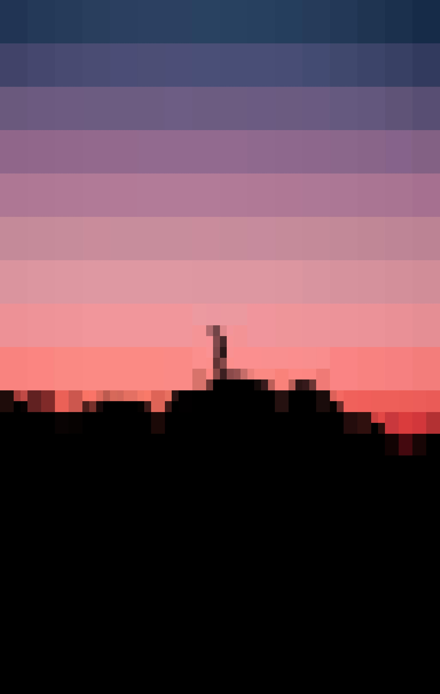
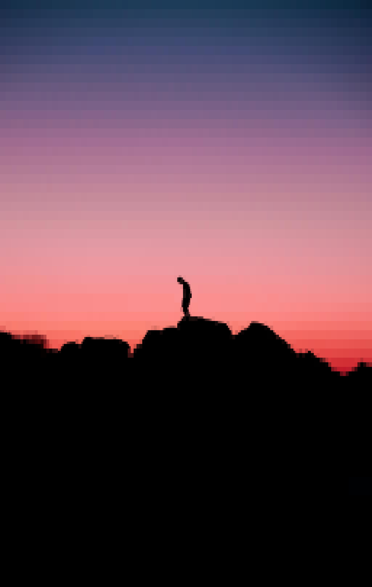
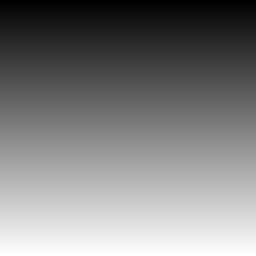

# Quadtree Image Compression

This library implements an image compression algorithm that is based on quadtrees. It can radically reduce the size of images while still preserving detail.

Features:

- **Compressing** images and **rendering** the simplified version

- **Encoding** the compressed data to a compact binary representation

- **Decoding** the binary and reconstructing the image

The algorithm works by starting with an empty image and **incrementally adding detail** where it is important. At the beginning the compressed image is filled with the average color of the original image. Then, it recursively **subdivides** the regions that have the most detail into 4 quads that each have the average color of the area they represent in the original image.

https://user-images.githubusercontent.com/28511584/211117608-29ff4349-64de-4250-a7fa-931b76a1392b.mp4

How does the algorithm determine the **amount of detail** in a given quad region? The metric used is the **standard deviation** of the colors of the pixels in the region, multiplied by the **size** of the region (simply the number of pixels `width * height`). If all the pixels have the same color, then the standard deviation is 0, meaning that it does not need to be divided any further. If there are many different colors over a large area, then the detail metric will have a high value.

## Examples

| 100 Iterations           | 1,000 Iterations          | 20,000 Iterations          |
| ------------------------ | ------------------------- | -------------------------- |
|   |   |   |
|   |   |   |
|  |  |  |

To see the compressed size of these images and other interesting facts about them, scroll down to the *Benchmark* section.

## Usage

To use the quadtree image compression algorithm, simply copy the `quad_tree_compression.py` file and import it into your scripts. It requires `numpy`, `Pillow`, `tqdm` and `sortedcontainers` to be installed. If you also want to run the image benchmark (`benchmark.py`), in addition you will need `tabulate` and `scikit-image` (which is used for analysing the input image).

The `quad_tree_compression` file provides easy helper functions for performing common operations (such as compressing and loading images) but also gives you access to the underlying classes.

**Compressing and loading an image:**

```python
from quad_tree_compression import compress_image_file, reconstruct_image_from_file

# Compress the image and encode is a binary file (any file extension can be chosen)
compress_image_file("input/mountain.jpg", "output/mountain_qt.qid", iterations=20_000)

# Reconstruct the image from the binary file. (Returns a PIL.Image object)
image = reconstruct_image_from_file("output/mountain_qt.qid")
image.show()
```

**Using the compressed image data (a numpy array) directly:**

```python
from quad_tree_compression import compress_image_data
from PIL import Image
import numpy as np

# Load the image and convert it to a numpy array
image = Image.open("input/mountain.jpg")
image_data = np.array(image)

# Compress the image
compressed_data = compress_image_data(image_data, iterations=20_000)

# Show the simplified image
compressed_image = Image.fromarray(compressed_data)
compressed_image.show()
```

**Working with the binary representation directly:**

```python
from quad_tree_compression import compress_and_encode_image_data, reconstruct_image_data
from PIL import Image
import numpy as np

# Load the image and convert it to a numpy array
image = Image.open("input/mountain.jpg")
image_data = np.array(image)

# Compress the image and encode it to the binary representation (a "bytes" object).
compressed_binary = compress_and_encode_image_data(image_data, iterations=20_000)

# Decode the compressed binary and convert it to a numpy array
compressed_image_data = reconstruct_image_data(compressed_binary)

# Show the simplified image
compressed_image = Image.fromarray(compressed_image_data)
compressed_image.show()
```

**Advanced: interacting with the image compressing class directly:**

```python
from quad_tree_compression import ImageCompressor
from PIL import Image
import numpy as np

# Load the image and convert it to a numpy array
image = Image.open("input/mountain.jpg")
image_data = np.array(image)

# Create a new ImageCompressor which allows you to incrementally add detail
compressor = ImageCompressor(image_data)

# Perform 10000 iterations
compressor.add_detail(10_000)

# Render the compressed image to a numpy array and display it
compressed_data = compressor.draw()
compressed_image = Image.fromarray(compressed_data)
compressed_image.show()

# Perform another 50000 iterations (total is 60000 then)
compressor.add_detail(50_000)

# Convert the output to a compressed binary representation
compressed_binary = compressor.encode_to_binary()
```

**Advanced: interacting with the underlying quadtree data structure:**

Internally, there are three classes that are used for compressing and reconstructing images. The base class `QuadTreeNode` takes care of positioning, sizing and subdividing. When compressing the image, the `CompressNode` class is used (which inherits from `QuadTreeNode`). When reconstructing the image, the `ReconstructNode` class is used (which also inherits from `QuadTreeNode`).

```python
from quad_tree_compression import ImageCompressor, reconstruct_quadtree
from PIL import Image
import numpy as np

# ...

compressor = ImageCompressor(image_data)
compressor.add_detail(10_000)

# You can access the compression quadtree directly 
# (type: CompressNode which is a subclass of the QuadTreeNode class)
tree = compressor.root_node
print(tree)
print(tree.top_left_node)
print(tree.color)

# ...

# When you are loadinng the tree from the binary representation, you 
# can also access the quadtree:
# (type: ReconstructNode which is a subclass of the QuadTreeNode class)
tree = reconstruct_quadtree(compressed_binary_data)
print(tree)
```

## Binary Representation

This library uses a **custom binary representation** to minimise the output file size. To reconstruct the image, it needs to store the structure of the quadtree (which nodes are subdivided, their positions, ...) and the colors of the nodes.

However, a few tricks can be used to minimise the resulting file size:

- The algorithm only needs to store **whether each node in the tree is subdivided or not**. Their exact **position and size can be reconstructed** from the structure of the tree when loading the tree. The algorithm simply performs a preorder traversal over the quadtree, storing their `is_subdivided` flag. As this is a boolean, using an entire byte to store it would be incredibly inefficient, wasting 87.5% of the space. Therefore they are stored as individual bits of a **bitset**.

- **Only the leaf nodes of the tree are drawn**. Therefore only the colors of these need to be stored.

- The combined data can be further compressed using **general-purpose compression algorithms** (`lzma` in this case).

In the end, the following information is stored (before general-purpose compression):

- **Width** of the image (4 bytes)

- **Height** of the image (4 bytes)

- **Bitset** containing the `is_subdivided` flags (4 bytes for the length, and 1 byte per 8 nodes)

- **Colors** of the leaf nodes (3 bytes for RGB per leaf node)

## Benchmark

How good is the quadtree algorithm at compressing images? To try to answer this question, we can have a look at different aspects and test the algorithm on a variety of images.

To measure the **compression ratio**, we can compare it with the size of a PNG or JPEG file storing the same image.

Furthermore, it would be interesting to quantify the **compression "quality"**, seeing how similar it is to the original image. The benchmark (`benchmark.py`) uses the average of the **mean absolute error** (MAE) of each channel (red, green and blue). This value is easy to interpret, as it shows how far the red, green and blue values of each pixel are from the original on average (the color values range from 0-255).

However, this value can be **misleading**, as some compressed images have a better (lower) MAE value than other compressed images which subjectively look better. For example, if an image only uses red colors (one of the three channels) the MAE at a low iteration count will have a comparatively small value. The MAE of an image that uses all three channels but was compressed using a higher iteration count may be higher (worse!) than that of the "simpler" image.

Therefore it helps to estimate the **image difficulty**. There are two aspects that influence how challenging an image is to compress:

- The usage of a wide range of different **colors**, a high dynamic range, ..., which is measured as the **entropy of the histogram** of the image (more precisely: the average entropy of the histogram of each channel).

- Furthermore, the complexity of the structures and arrangement of colors plays an important role. Although an image with white noise has the same entropy value regarding its histogram as a smooth gradient image, they are clearly not equally easy to compress.
  
  | Noise                   | Gradient               |
  | ----------------------- | ---------------------- |
  |      |  |
  | Histogram Entropy: 7.99 | Histogram Entropy: 8.0 |
  
  Therefore, the benchmark calculates the **local entropy of each region** in the image using `scikit-image` and computes the average.
  
  | Noise                       | Gradient                       |
  | --------------------------- | ------------------------------ |
  |  |  |
  | Mean Local Entropy: 6.02    | Mean Local Entropy: 3.26       |
  
  The following image shows the local entropy map of a more realistic test image depicting a mountain:
  
  
  
  The mean local entropy score calculated from this image is 1.339.

### Benchmark Results

| Original             | 80,000 Iterations          |
| -------------------- | -------------------------- |
|  |  |

```
----------  ------
     Width    3712
    Height    4640
Resolution  17.2MP
----------  ------
```

Metrics of difficulty (0 = empty image; the higher, the more difficult):

```
------------------  -----
Mean Local Entropy  4.305
Histogram Entropy   7.607
------------------  -----
```

```
        File Type    Size (KB)
-----------------  -----------
              PNG     17,372.9
JPG (90% quality)      3,811.6
```

```
  Iterations    Compressed    Mean Average    Size Reduction    Size Reduction    Compression    Compression
                 Size (KB)           Error           PNG (%)           JPG (%)     Factor PNG     Factor JPG
------------  ------------  --------------  ----------------  ----------------  -------------  -------------
         100          0.93           14.04             99.99             99.98       18720.8         4107.28
        1000          7.68            8.79             99.96             99.8         2260.92         496.04
       20000         93.09            5.76             99.46             97.56         186.63          40.95
       80000        307.03            5.17             98.23             91.94          56.58          12.41
```

| Original               | 80,000 Iterations            |
| ---------------------- | ---------------------------- |
|  |  |

```
----------  ------
     Width    5472
    Height    3648
Resolution  20.0MP
----------  ------
```

```
------------------  -----
Mean Local Entropy  1.339
Histogram Entropy   6.69
------------------  -----
```

```
        File Type    Size (KB)
-----------------  -----------
              PNG      5,611.4
JPG (90% quality)        993.6
```

```
  Iterations    Compressed    Mean Average    Size Reduction    Size Reduction    Compression    Compression
                 Size (KB)           Error           PNG (%)           JPG (%)     Factor PNG     Factor JPG
------------  ------------  --------------  ----------------  ----------------  -------------  -------------
         100          0.94            7.77             99.98             99.91        5995.12        1061.51
        1000          7.85            4.15             99.86             99.21         714.65         126.54
       20000        134               1.62             97.61             86.51          41.88           7.41
       80000        471.68            1.01             91.59             52.53          11.9            2.11
```

| Original             | 80,000 Iterations          |
| -------------------- | -------------------------- |
|  |  |

```
----------  ------
     Width    3744
    Height    5616
Resolution  21.0MP
----------  ------
```

```
------------------  -----
Mean Local Entropy  5.039
Histogram Entropy   7.452
------------------  -----
```

```
        File Type    Size (KB)
-----------------  -----------
              PNG     34,908.6
JPG (90% quality)      7,372.6
```

```
  Iterations    Compressed    Mean Average    Size Reduction    Size Reduction    Compression    Compression
                 Size (KB)           Error           PNG (%)           JPG (%)     Factor PNG     Factor JPG
------------  ------------  --------------  ----------------  ----------------  -------------  -------------
         100          0.92           19.67            100                99.99       38109.8         8048.69
        1000          7.44           15.8              99.98             99.9         4694.54         991.47
       20000        127.7            12.58             99.63             98.27         273.36          57.73
       80000        469.73           11.36             98.65             93.63          74.32          15.7
```

| Original             | 80,000 Iterations          |
| -------------------- | -------------------------- |
|  |  |

```
----------  ------
     Width    3957
    Height    6240
Resolution  24.7MP
----------  ------
```

```
------------------  -----
Mean Local Entropy  2.475
Histogram Entropy   5.321
------------------  -----
```

```
        File Type    Size (KB)
-----------------  -----------
              PNG     15,051.9
JPG (90% quality)      3,259.4
```

```
  Iterations    Compressed    Mean Average    Size Reduction    Size Reduction    Compression    Compression
                 Size (KB)           Error           PNG (%)           JPG (%)     Factor PNG     Factor JPG
------------  ------------  --------------  ----------------  ----------------  -------------  -------------
         100          0.86            4.78             99.99             99.97       17502.3         3790.03
        1000          5.75            2.99             99.96             99.82        2618.64         567.05
       20000         71.04            2.62             99.53             97.82         211.87          45.88
       80000        254.64            2.55             98.31             92.19          59.11          12.8
```

| Original              | 80,000 Iterations           |
| --------------------- | --------------------------- |
|  |  |

```
----------  ------
     Width    5472
    Height    3648
Resolution  20.0MP
----------  ------
```

```
------------------  -----
Mean Local Entropy  0.014
Histogram Entropy   1.374
------------------  -----
```

```
        File Type    Size (KB)
-----------------  -----------
              PNG         68.4
JPG (90% quality)        393.4
```

```
  Iterations    Compressed    Mean Average    Size Reduction    Size Reduction    Compression    Compression
                 Size (KB)           Error           PNG (%)           JPG (%)     Factor PNG     Factor JPG
------------  ------------  --------------  ----------------  ----------------  -------------  -------------
         100          0.56            5.24             99.19             99.86         122.97         707.58
        1000          1.58            0.62             97.69             99.6           43.38         249.63
       20000          3.58            0                94.77             99.09          19.12         110.01
       80000          3.58            0                94.77             99.09          19.12         110.01
```

| Original            | 80,000 Iterations         |
| ------------------- | ------------------------- |
|  |  |

```
----------  ------
     Width    4160
    Height    6240
Resolution  26.0MP
----------  ------
```

```
------------------  -----
Mean Local Entropy  3.438
Histogram Entropy   5.722
------------------  -----
```

```
        File Type    Size (KB)
-----------------  -----------
              PNG     25,385.6
JPG (90% quality)      3,886.6
```

```
  Iterations    Compressed    Mean Average    Size Reduction    Size Reduction    Compression    Compression
                 Size (KB)           Error           PNG (%)           JPG (%)     Factor PNG     Factor JPG
------------  ------------  --------------  ----------------  ----------------  -------------  -------------
         100          0.88            7.73            100                99.98       28716.8         4396.62
        1000          6.64            4.54             99.97             99.83        3825.44         585.69
       20000         83.59            2.73             99.67             97.85         303.7           46.5
       80000        286.11            2.4              98.87             92.64          88.73          13.58
```

| Original            | 80,000 Iterations         |
| ------------------- | ------------------------- |
|  |  |

```
----------  ------
     Width    4000
    Height    6000
Resolution  24.0MP
----------  ------
```

```
------------------  -----
Mean Local Entropy  2
Histogram Entropy   5.868
------------------  -----
```

```
        File Type    Size (KB)
-----------------  -----------
              PNG     13,039.2
JPG (90% quality)      1,774.4
```

```
  Iterations    Compressed    Mean Average    Size Reduction    Size Reduction    Compression    Compression
                 Size (KB)           Error           PNG (%)           JPG (%)     Factor PNG     Factor JPG
------------  ------------  --------------  ----------------  ----------------  -------------  -------------
         100          0.83           11.48             99.99             99.95       15672.1         2132.64
        1000          7.06            6.8              99.95             99.6         1847.96         251.47
       20000        128.21            2.66             99.02             92.77         101.7           13.84
       80000        485.07            1.67             96.28             72.66          26.88           3.66
```

| Original               | 80,000 Iterations            |
| ---------------------- | ---------------------------- |
|  |  |

```
----------  ------
     Width    4039
    Height    6058
Resolution  24.5MP
----------  ------
```

```
------------------  -----
Mean Local Entropy  3.044
Histogram Entropy   6.514
------------------  -----
```

```
        File Type    Size (KB)
-----------------  -----------
              PNG     23,573.7
JPG (90% quality)      5,023.5
```

```
  Iterations    Compressed    Mean Average    Size Reduction    Size Reduction    Compression    Compression
                 Size (KB)           Error           PNG (%)           JPG (%)     Factor PNG     Factor JPG
------------  ------------  --------------  ----------------  ----------------  -------------  -------------
         100          0.92           20.28            100                99.98       25735.5         5484.15
        1000          7.46           12.98             99.97             99.85        3161.71         673.75
       20000        132.92            9.16             99.44             97.35         177.36          37.79
       80000        504.67            7.21             97.86             89.95          46.71           9.95
```

## Credits

All sample images sourced and credited to Unsplash. See `input/credits.txt` for details.
